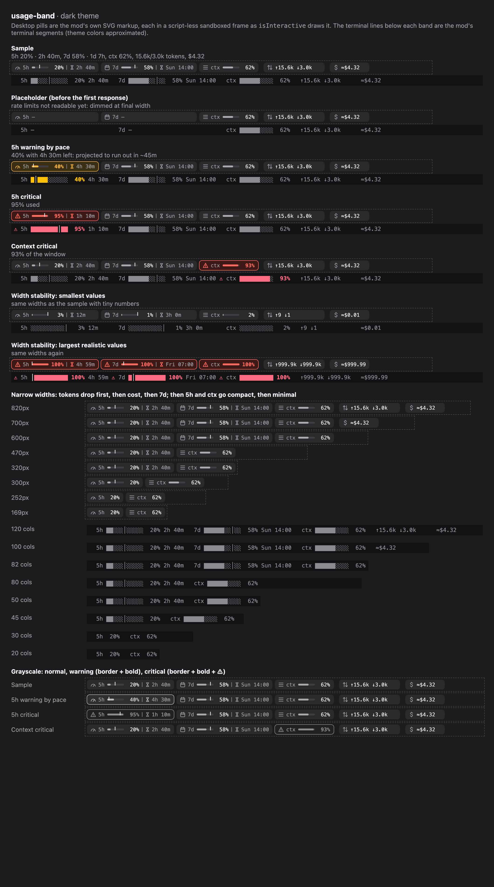

# claude-mods

Mods for [Claude Code](https://claude.com/claude-code), written as plugins of function hooks. This repository is a plugin marketplace: each mod installs with one line.

| Mod | What it does |
| --- | --- |
| [usage-band](mods/usage-band) | A row of pills above the prompt: 5-hour and 7-day rate limits with pace, context, tokens and cost. |

## Install

Type this at the prompt of a Claude Code terminal session:

```
/plugin install usage-band --marketplace tahabozdemir/claude-mods
```

Answer `y` to add the marketplace, then press Enter to pick the user scope. The mod is active right away, and in every session after that, including the desktop app's Code tab.

## usage-band



A band above the prompt that shows, left to right:

- **5h / 7d**: how much of each rate-limit window is used, a tick for how much of the window has passed, and when it resets. A pill turns yellow when your pace would hit the limit before the reset, and red with `⚠` when you are at 90% or about to run out.
- **ctx**: how full the context window is (yellow from 70%, red from 90%).
- **↑ ↓**: input and output tokens for the session, subagents included.
- **≈$**: session cost at API list prices. Hidden by default on a subscription.

The rate-limit pills appear only on a subscription plan, since only subscriptions report those windows. On a narrow window the band drops tokens, then cost, then 7d, and then draws 5h and ctx more compactly. It never wraps.

### Commands

| Command | Effect |
| --- | --- |
| `/usage-pill` | Refresh now and print a one-line summary |
| `/usage-pill hide` / `show` | Hide or show the band |
| `/usage-pill cost on` / `off` / `auto` | Show the cost pill, hide it, or hide it only on a subscription (the default) |

### Options

- **Desktop cell width (px)** (`desktopCellPx`, default `7.2`): CSS pixels per column of the desktop app's code font, used to fit the band. Raise it if the desktop band drops pills it has room for.

### Requirements

Exact token counts come from the session transcripts, read by `scripts/tokens.mjs` with Node.js (`node` on `PATH`, `/usr/local/bin/node` or `/opt/homebrew/bin/node`). Without Node the band falls back to summing each turn's usage and marks the numbers with `~`.

## Development

Run a mod straight from this folder:

```sh
claude --plugin-dir ./mods/usage-band
```

Saving a file reloads the mod in the running session. Check and test it with:

```sh
claude plugin validate .                    # the marketplace file
claude plugin validate mods/usage-band      # the manifest and the hooks module
claude plugin test mods/usage-band          # the *.test.ts files
```

Once the mod has loaded, Claude Code writes its type definitions to `mods/usage-band/.claude-plugin/types/` (git-ignored), and `tsc -p mods/usage-band` type-checks it.

## License

[MIT](LICENSE)
