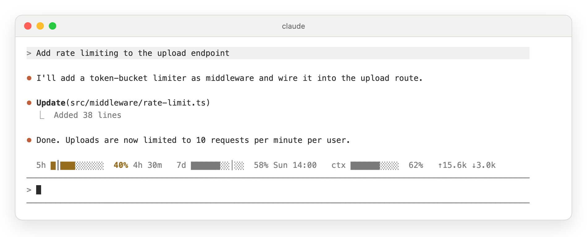
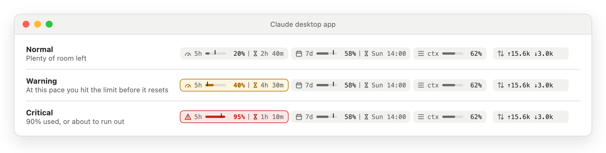

# usage-band

A row of pills above the Claude Code prompt that shows how much of your plan you have used, and warns you before you run out.

<picture>
  <source media="(prefers-color-scheme: dark)" srcset="../../docs/images/hero-dark.png">
  
</picture>

## Install

```
/plugin install usage-band --marketplace tahabozdemir/claude-mods
```

Type `y`, then press Enter twice. See the [main README](../../README.md#install) for the full steps.

## What it shows

| Pill | Meaning |
| --- | --- |
| **5h** | How much of the 5-hour rate limit you have used, and when it resets. |
| **7d** | The same for the 7-day limit. |
| **ctx** | How full the conversation's context window is. |
| **↑ ↓** | Tokens sent and received this session, subagents included. |
| **≈$** | Session cost at API list prices. Hidden on a subscription unless you turn it on. |

The thin line inside a 5h or 7d bar marks how much of the window has passed. If the fill is ahead of that line, you are using the limit faster than it refills.

### Colors

<picture>
  <source media="(prefers-color-scheme: dark)" srcset="../../docs/images/states-dark.png">
  
</picture>

- **Gray:** you are fine.
- **Yellow:** at your current pace you will hit the limit before it resets, or you have used 75%. For ctx, the context is 70% full.
- **Red with ⚠:** you have used 90%, or you will run out soon: within 30 minutes for 5h, within a day for 7d. For ctx, the context is 90% full.

The 5h and 7d pills appear only on a Claude subscription plan, because only subscriptions have these limits. When the window is narrow, the band drops tokens first, then cost, then 7d, and then draws 5h and ctx more compactly. It never wraps. The [full state sheet](../../docs/images/usage-band-all-states-dark.png) shows every case.

## Commands

| Command | What it does |
| --- | --- |
| `/usage-pill` | Refresh now and print a one-line summary |
| `/usage-pill hide` | Hide the band |
| `/usage-pill show` | Show it again |
| `/usage-pill cost on` | Always show the cost pill |
| `/usage-pill cost off` | Never show the cost pill |
| `/usage-pill cost auto` | Hide the cost pill on a subscription, show it otherwise (the default) |

Your choices are remembered across sessions.

## Options

Set them when you install, or later from a terminal:

```sh
echo '{"desktopCellPx": "8.4"}' | claude plugin configure usage-band@claude-mods --values-stdin
```

| Option | Default | What it does |
| --- | --- | --- |
| Desktop cell width (px) | `7.2` | CSS pixels per column of the desktop app's code font, used to fit the band. Raise it if the desktop band drops pills it has room for. |

## How it works

- Rate limits, context and cost come from Claude Code itself, refreshed after every response and every 30 seconds.
- Token totals come from the session's transcript files in `~/.claude/projects/`, summed by [`scripts/tokens.mjs`](scripts/tokens.mjs) with Node.js. The script runs only when the transcript has changed.
- Without Node.js (`node` on `PATH`, `/usr/local/bin/node` or `/opt/homebrew/bin/node`), the band adds up each turn's usage instead and marks the numbers with `~`.
- Everything stays on your machine. The mod makes no network requests.

## Troubleshooting

**The band doesn't appear.** It shows after the first response of a session. Run `/usage-pill`: if it prints a summary, the band may be hidden, and `/usage-pill show` brings it back. If the command is unknown, check that the mod is installed and enabled with `claude plugin list`.

**Token numbers start with `~`.** Node.js was not found, so the counts are estimates. Install Node.js to get exact counts.

**Something else is wrong.** Start Claude Code with `claude --debug`. Lines beginning with `usage-band:` explain what failed. Include them when you [open an issue](https://github.com/tahabozdemir/claude-mods/issues/new/choose).
